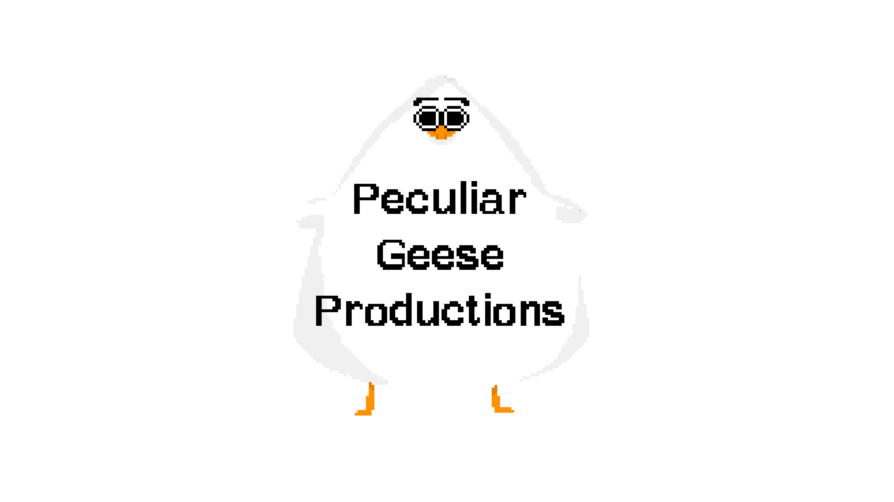
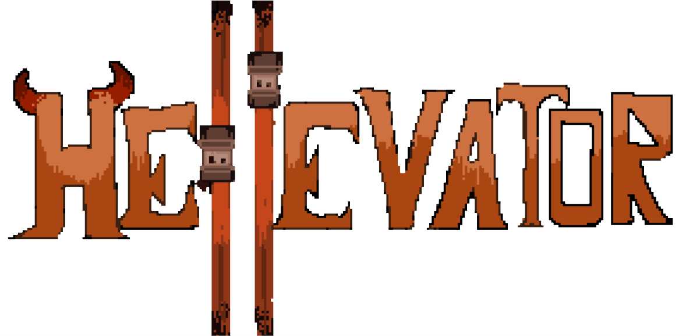
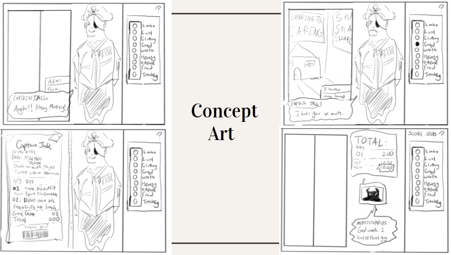
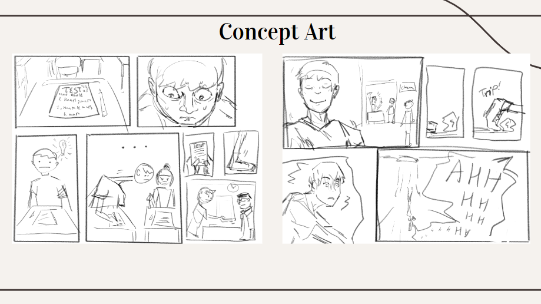
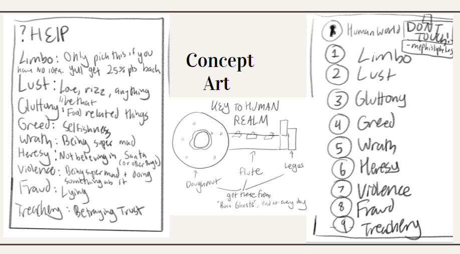

<h1><em>...presents...</em></h1>

___

Play as *Dante*, a twelve-year-old who fell into hell by **sheer accident** after cheating on his math test!  
Work for your new "boss", *Mephistopheles*, as an elevator operator - judging the *crimes* on the **life receipts** of ghosts, spirits, souls (whatever you call them) and transporting them to their "eternal punishment"!  
Gain or lose your boss's trust, all while under the pressure of time (as he has high expectations of your efficiency), or be ***doomed***!

# Trailer

<video src="https://raw.githubusercontent.com/ObjectOops/Hellevator/gh-pages/assets/Hellevator_Trailer.mp4" style="max-width: 100%" controls></video>

# Play

| Platform / Latest Download | Instructions |
| --- | --- |
| [Windows Intel 64-bit](https://github.com/ObjectOops/Hellevator/releases/download/v1.0.0/Hellevator_Windows_Intel64.zip) | Unzip and run `Hellevator.exe`. |
| [Android ARM64 and ARMv7](https://github.com/ObjectOops/Hellevator/releases/download/v1.0.0/Hellevator_Android.apk) | Install the APK by running it from a file explorer. |
| [Web Browser (click to play)](./play) | It's recommended that a native installation be used instead. Use a browser that supports WebAssembly. Once the game loads, click on an empty area of the screen, or the pause button, to wake up the audio player. **Afterwards, refresh the tab at least once so the cutscene plays properly** (otherwise it skips itself for some reason). Not supported on mobile. |
> [GitHub Releases Page (more info)](https://github.com/ObjectOops/Hellevator/releases)

# Gallery
## Concept Art

## Planning

